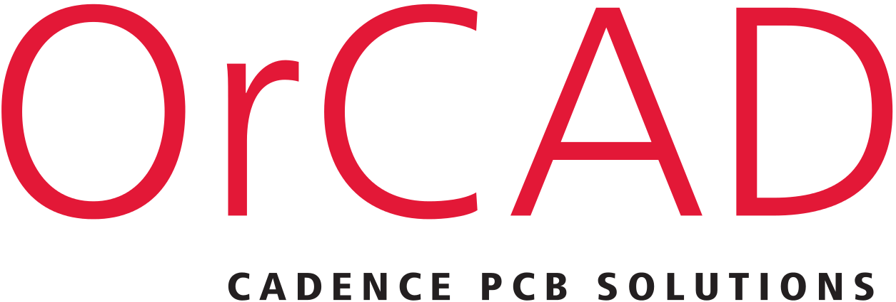

<!--
**ZahraBenslimane/ZahraBenslimane** is a ✨ _special_ ✨ repository because its `README.md` (this file) appears on your GitHub profile.

Here are some ideas to get you started:

- 🔭 I’m currently working on ...
- 🌱 I’m currently learning ...
- 👯 I’m looking to collaborate on ...
- 🤔 I’m looking for help with ...
- 💬 Ask me about ...
- 📫 How to reach me: ...
- 😄 Pronouns: ...
- ⚡ Fun fact: ...
-->

### Hi there 👋, my name is Zahra BENSLIMANE

I am a last year Masters student majoring in [Smart Systems Engineering](https://sciences.sorbonne-universite.fr/formation/offre-de-formation/masters/master-automatique-robotique/parcours-ingenierie-des-systemes) at Sorbonne University, France. 

***About me ....***

✔ I am a last year Masters student majoring in [Smart Systems Engineering](https://sciences.sorbonne-universite.fr/formation/offre-de-formation/masters/master-automatique-robotique/parcours-ingenierie-des-systemes) at Sorbonne University, France. 
✔ I’m currently Developing a Gutenberg Block Plugin **Html, CSS, React.js,Js & Php language** 
✔ I’m currently learning about **React**🥰 
✔ An open source contributor. Please find my free plugin on 
  **wordpress.org <a href="https://wordpress.org/plugins/attendance-management-for-lifterlms/">Attendance Managment &nbsp;&nbsp;&nbsp;&nbsp;&nbsp;&nbsp;For LifterLMS</a>** 
✔ A continuous language transaltion contributor 
  **<a href="https://profiles.wordpress.org/muhammadfaizanhaidar/#content-translations">Translations</a>**  
✔ I’m looking to collaborate with any **Open - WordPress Plugins Projects** 
✔ Ask me anything you want, If I am there I will answer within seconds 😉 
✔ Fun fact : *I Always try to learn something new and then sleep till it stores in my brain* 😎    

**My Interest**:
- Deep Learning
- Anomaly Detection
- Neural Networks compression technics
- Tiny ML

 **I am open to**:

- Any work collobration ,
- machine learning projects(development or research),
- research internships and

## Skills:

- Machine/deep learning
- Computer vision & Image processing
- Audio signals processing
- Electronics and embedded systems

#### Programming Languages, Labraries & Frameworks:

&nbsp;
&nbsp;

&nbsp;

&nbsp;

&nbsp;
&nbsp;

#### Hardware : 
I have also worked skills in electronics, microcontrollers and FPGA's
I have experience with :
   
   
## Connect with me:

 

   

